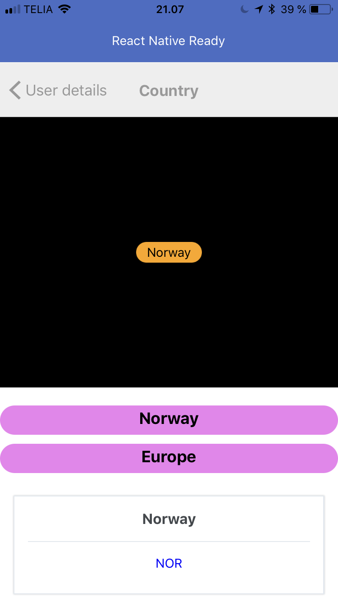

# React Native ready app

This project is a prototype for a mobile app with a simple navigation between user and country, and with this example we are exploring the mobile capatibilites and react native.

### Feito Com 

Abaixo segue o que foi utilizado na criação deste prototype:

- [React Native](http://facebook.github.io/react-native/) - O React Native é um framework que permite o desenvolvimento de aplicações mobile usando JavaScript e React;
- [Redux](https://redux.js.org/) - O Redux é um contêiner de estado previsível para aplicativos JavaScript. Ele ajuda você a escrever aplicativos que se comportam consistentemente, executados em diferentes ambientes (cliente, servidor e nativo) e são fáceis de testar; 
- [React Navigation](https://reactnavigation.org/) - O React Navigation surgiu da necessidade comunidade do React Native de uma navegação de forma fácil de se usar, e escrita toda em JavaScript;
- [React Native Gesture Handler](https://kmagiera.github.io/react-native-gesture-handler/) - API declarativa que permite a manipulação de toques e gestos no React Native;
- [Fetch](https://developer.mozilla.org/pt-BR/docs/Web/API/Fetch_API) - A Fetch API fornece uma interface para buscar recursos (por exemplo, em toda a rede);
- [Prop Types](https://github.com/facebook/prop-types) - Verificação de tipo em tempo de execução para propriedades (props) React e objetos semelhantes;
- [Reactotron](https://github.com/infinitered/reactotron) - O Reactotron é um app Desktop para inspecionar projetos em React ou React Native. Está disponível para macOS, Linux e Windows;
  - [reactotron-react-native](https://github.com/infinitered/reactotron/blob/master/docs/quick-start-react-native.md) - Plugin para configurar o Reactotron para se conectar ao projeto React Native;
  - [reactotron-redux](https://github.com/infinitered/reactotron/blob/master/docs/plugin-redux.md) - Plugin que permite acompanhar todas as Actions que são disparadas na aplicação, mostrando toda a estrutura da Action;
- [Babel](https://babeljs.io/) - O Babel é um compilador JavaScript gratuito e de código aberto e transpiler configurável usado no desenvolvimento de aplicações JavaScript;
  - [babel-eslint](https://github.com/babel/babel-eslint) - Este pacote é um _wrapper_ do parser do Babel para o ESLint;
- [Eslint](https://eslint.org/) - O ESLint é uma ferramenta de lint plugável para JavaScript e JSX;
  - [eslint-config-airbnb](https://github.com/airbnb/javascript/tree/master/packages/eslint-config-airbnb) - Este pacote fornece o .eslintrc do Airbnb como uma configuração compartilhada extensível;
  - [eslint-plugin-import](https://github.com/benmosher/eslint-plugin-import) - Plugin do ESLint com regras para ajudar na validação de imports;
  - [eslint-plugin-jsx-a11y](https://github.com/evcohen/eslint-plugin-jsx-a11y) - Verificador estático AST das regras do a11y em elementos JSX;
  - [eslint-plugin-react](https://github.com/yannickcr/eslint-plugin-react) - Regras de linting do ESLint específicas do React;
  - [eslint-plugin-react-native](https://github.com/Intellicode/eslint-plugin-react-native) - Regras de linting do ESLint específicas do React Native;
- [EditorConfig](https://editorconfig.org/) - O EditorConfig é um formatador de arquivos e coleções em forma de Plugin para Editores de código/texto com o objetivo de manter um padrão de código consistente entre diferentes editores, IDE's ou ambientes;
-[Apetools](https://apetools.webprofusion.com) - Gerador de icones e splash para android e ios

### Estrutura de arquivos está na segunte maneira:

A estrutura de arquivos está da seguinte maneira:

```bash
react-native-ready
├── src/
│   ├── config/
│   │   └── ReactotronConfig.js
│   ├── Views/
│   │   ├── Home/
│   │   │    └── index.js
│   │   ├── Review/
│   │   │    └── index.js
│   │   ├── Country/
│   │       └── index.js
│   ├── store/
│   │   ├── ducks/
│   │   │   └── index.js
│   │   └── index.js
│   ├── index.js
│   └── routes.js
├── .editorconfig
├── .eslintrc.json
├── .gitignore
├── babel.config.js
├── dependencies.json
├── devDependencies.json
├── index.js
├── LICENSE
├── package.json
├── screen.png
├── ...
└── README.md

```

### Variavel de Ambiente
If you need to connect in API's that requires, api key, you can use this .env file with the following keys:

```
API_KEY=
API_HOST=

```

### Run este projeto 

```sh
yarn

yarn start

```


# Screensort

  